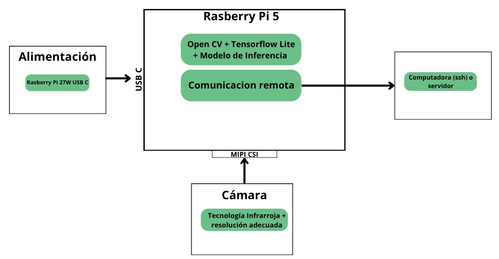
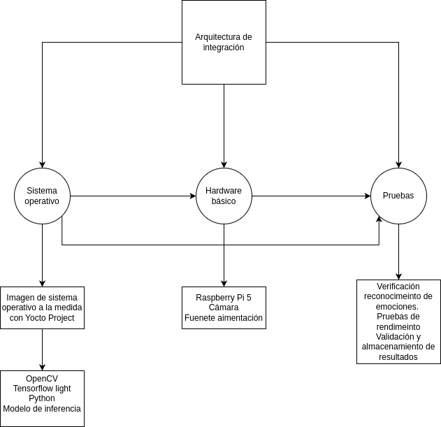

# Propuesta diseño

### Justificación del proyecto y revisión bibliográfica

El reconocimiento automático de emociones humanas es un tema que ha ganado bastante relevancia dentro del campo de la inteligencia artificial y la visión por computadora. Hoy en día, este tipo de tecnología se está usando en muchas áreas, como mejorar la experiencia del usuario, personalizar contenido o incluso para analizar el comportamiento de grandes grupos de personas, algo que se ve mucho en la industria del entretenimiento.

Para este proyecto, la idea principal es diseñar un sistema embebido que sea capaz de reconocer expresiones faciales dentro de una sala de cine. Para lograr esto, se plantea usar nodos de procesamiento en el borde (Edge AI) utilizando Raspberry Pi, ya que son accesibles, versátiles y bastante potentes para este tipo de aplicaciones.

Estamos usando técnicas de aprendizaje automático, especialmente redes neuronales convolucionales (CNN), junto con herramientas como OpenCV y TensorFlow Lite. Estas nos permiten hacer la clasificación de emociones en tiempo real con buena precisión. Además, al procesar los datos directamente en el nodo (es decir, en la Raspberry Pi), se reduce la latencia y se cuida la privacidad del usuario, ya que la información no necesita salir del dispositivo.

Para sustentar el enfoque del proyecto, revisamos al menos diez fuentes bibliográficas, incluyendo investigaciones sobre reconocimiento de emociones, aplicaciones de Raspberry Pi en Edge AI, y documentación sobre cómo usar Yocto Project para crear sistemas embebidos personalizados.

### Descripción y síntesis del problema

No se cuenta con un sistema electrónico que permita analizar el comportamiento humano de las emociones frente a las experiencias vividas dentro de una sala de cines. El análisis de emociones resulta un insumo muy valioso para tomar decisiones en las experiencias de entretenemiento, donde los usuarios cada día tienen espectativas más altas en el área del entretenimiento. 

La empresa contratista necesita el diseño de un sistema embebido que se pueda integrar dentro de una sala de cine para evaluar las emociones de las personas ante un estímulo visual determinado in situ, y no depender de técnicas clásicas como entrevistas que tratan de evaluar lo mismo, pero que presentan una serie de problemas al no realizarse justo en el momento que suceden los estímulos visuales, auditivos o incluso, físicos: percepción alterada de lo vivido, magnificar o minimizar al ser consultados de forma oral, sesgo por la propia entrevista, etc. 

### Gestión de los requerimientos

| ID      | Tipo         | Descripción                                                                                                                        | Justificación                                                                                         | Prioridad |
|---------|--------------|------------------------------------------------------------------------------------------------------------------------------------|--------------------------------------------------------------------------------------------------------|-----------|
| REQ-01  | Funcional    | El sistema debe detectar y clasificar emociones en tiempo real a partir de imágenes capturadas.                                   | Permite analizar la respuesta emocional inmediata ante estímulos visuales.                            | Alta      |
| REQ-02  | Funcional    | El sistema debe identificar al menos seis emociones: enojo, disgusto, miedo, felicidad, tristeza y sorpresa.                      | Son las emociones especificadas en el instructivo.                                                     | Alta      |
| REQ-03  | Funcional    | La captura de imágenes debe realizarse de forma automática, sin intervención del usuario.                                          | Garantiza que la experiencia del espectador no se vea alterada ni sesgada.                            | Alta      |
| REQ-04  | Funcional    | El procesamiento y clasificación de emociones debe realizarse localmente en los Raspberry Pi (Edge computing).                    | Reduce latencia y evita sobrecarga en redes o servidores centrales.                                   | Alta      |
| REQ-05  | Técnica      | El sistema debe integrar OpenCV y TensorFlow Lite para visión por computador y aprendizaje automático.                            | Permite una implementación eficiente en hardware limitado.                                             | Alta      |
| REQ-06  | No funcional | Los nodos deben estar camuflados en los asientos del cine y no interferir con la proyección.                                      | Asegura que el sistema no altere la naturalidad del entorno ni del comportamiento del espectador.     | Media     |
| REQ-07  | Técnica      | Se debe sintetizar una imagen de Linux personalizada con Yocto Project que incluya todas las dependencias requeridas.             | Facilita el despliegue del sistema en Raspberry Pi de forma controlada y reproducible.                | Alta      |
| REQ-08  | Técnico    | El sistema debe tener una manera de acceder a su configuración remotamente.                                                         | Permite establecer una conexión remota y transferir resultados para el posterior análisis.            | Alta      |

Requerimientos de hardware específicos: 

Unidad de procesamiento: contar con una Raspberry Pi con suficiente poder computacional para realizar la inferencia dadas las imagenes o video, lo suficientemente rápido sin demasiada latencia y así poder realizar un buen análisis de los estimulos dentro del cine. 

Cámara: contar con una cámara de tamaño reducido para cumplir con el requerimiento REQ-06. Debe contar con técnología infrarroja para un ambiente de baja luz, como lo suelen ser las salas de cine. 

Alimentación: raspberry Pi 27W USB-C Power Supply (oficial).

Disipación de calor: es necesario verificar la temperatura de sistema durante funcionamiento, en caso de requerirlo, implementar un disipador de calor. 

### Vista operacional del sistema

En el presente proyecto se propone el desarrollo de un sistema embebido orientado al reconocimiento de emociones faciales en tiempo real, dentro del contexto de una sala de cine. La plataforma seleccionada para la implementación es la Raspberry Pi, debido a su bajo costo, tamaño reducido y capacidad para ejecutar modelos de aprendizaje automático en el borde (Edge AI). A esta se le conecta una cámara (ya sea CSI o USB), encargada de capturar imágenes de los rostros de los espectadores durante la proyección de la película.

Las imágenes capturadas son procesadas localmente mediante modelos preentrenados de reconocimiento de emociones, optimizados para funcionar con TensorFlow Lite. Esto permite que el sistema realice inferencias directamente en la Raspberry Pi, sin necesidad de enviar los datos a la nube, lo que contribuye tanto a reducir la latencia como a preservar la privacidad de los usuarios, ya que los datos sensibles no abandonan el nodo local.

Una vez procesada la imagen, el sistema clasifica la emoción detectada (por ejemplo, alegría, tristeza, sorpresa, entre otras) y registra este resultado en un archivo local, junto con una marca temporal. De manera opcional, si se requiere un análisis agregado o una supervisión externa, los datos almacenados pueden ser enviados a un servidor remoto mediante una conexión de red.

Este enfoque permite construir un sistema distribuido, escalable y autónomo, capaz de adaptarse a distintos entornos sin requerir infraestructura computacional centralizada.

**Diagrama de casos de uso (referencial)**

- El espectador es captado por la cámara.
- El sistema analiza su expresión facial utilizando el modelo de detección de emociones.
- El resultado es clasificado y almacenado localmente con marca temporal.

---

### Vista funcional del sistema

Desde el punto de vista funcional, el sistema está compuesto por varios módulos que operan de forma coordinada en la Raspberry Pi. Las principales funciones que lo integran son las siguientes:

- **Captura de video:** adquisición de imágenes en tiempo real a través de una cámara CSI o USB.
- **Preprocesamiento de imagen:** incluye operaciones como escalado, normalización y conversión de color, necesarias para adaptar la imagen a los requerimientos del modelo.
- **Clasificación de emociones:** se utiliza un modelo de redes neuronales convolucionales optimizado con TensorFlow Lite, entrenado previamente para reconocer expresiones faciales comunes.
- **Registro de resultados:** los datos obtenidos (emoción detectada y marca temporal) se almacenan en archivos locales estructurados para facilitar su análisis posterior.
- **Comunicación con servidor (opcional):** si se habilita esta función, el sistema puede enviar los datos a una unidad centralizada para realizar un análisis global, visualización o generación de estadísticas.

Cada una de estas funciones se encapsula en módulos de software independientes, lo que facilita el mantenimiento, la escalabilidad y la integración con otros sistemas. La arquitectura propuesta busca un equilibrio entre procesamiento local eficiente y posibilidad de expansión hacia entornos distribuidos.

### Arquitectura del sistema propuesto

### Análisis de dependencias

A nivel del entorno de trabajo Yocto Proyect, se tiene las siguientes dependencias: 

Meta-layers principales:

--Meta-raspberry pi: anñade los drives y dependencias necesarias para correr la imagen en dicho dispositivo
--Meta-poky: proporcionan el sistema base de Linux, incluyen herramientas esenciales del sistema y bibliotecas base, además de que proveen el framework BitBake para la construcción de imágenes.

--Meta-tensorflow-light: paquete para usar tensor flow light. 

--Meta-openembedded ---> meta-openembedded/meta-oe, meta-openembedded/meta-python, meta-openembedded/meta-multimedia: incluye dependencias generales para multimedia e IA y ofrece bibliotecas de utilidad necesarias para procesamiento de imagen. Así coo herramientas específicas para python como open cv.

--Meta-networking: dispone de servicios de conexión.
  - Conexión ssh o envío de datos wifi.

--Meta-personalizada: aplicación específica que procesa las clasificaciones, ya sea almacenarlas localemtne o enviarlas a un sever remoto. 
  - Aplicación de uso específico (python, por ejemplo). 
  
A nivel de archivo local.config, es necesario llamar las dependencias necesarias relacionadas a python, como python3-opencv. 

### Estrategia de integración de la solución

Fase de desarrollo

1. Desarrollo de la imagen base:
   
Se  integran la lista de dependencias en el flujo de trabajo de Yocto Proyect para la construcción de la imagen a la medida para la Raspberry Pi 5, contemplando las meta-layers, modificaciones en el archivo local.conf así como las dependencias necesarias para tener los drivers para la cámara.

2. Desarrollo de la aplicación:
   
Con los resultados del modelo de clasificación, los resultados deben ser procesados y almacenados local o remotamente. Debe existir un layer personalizada para este caso.

3. Building de la imagen:
   
Se construye la imagen y se solucionan los errores de construcción.

4. Verificación del modelo y aplicación:
   
Verifcar y validar la correcta clasficación de emociones para un video de prueba cargado localemnte en la imagen. Si existen errores, regresar a punto 1 o 2. 

5. Cargado de la imagen y conexiones físicas:
   
Se carga la imagen en la rasberry Pi 5. Además se hace la conexión de la cámara y se prueba con la fuente de alimentación. 

6. Validar que la imagen se cargue correctamente sobre la Raspberry Pi 5 y detecte correctamente el periférico de la cámara.

7. Comprobar que el modelo siga clasificando correctamente, esta vez, con la fuente de video de la cámara y validar la aplicación. Si existen errores iterar a los puntos 2,3 y 5, para repetir la prueba de este punto 7. 

### Planeamiento de la ejecución.

**Actividades y cronograma:**

| Fecha        | Actividad                                               | Responsable                   |
|--------------|---------------------------------------------------------|-------------------------------|
| 6-10 mayo    | Investigación bibliográfica                              | Investigador                  |
| 10 mayo      | Definición de arquitectura del sistema                   | Líder Técnico                 |
| 11 mayo      | Redacción de propuesta preliminar                        | Auditor e Investigador        |
| 12-18 mayo   | Desarrollo de receta Yocto y dependencias                | Líder Técnico e Investigador  |
| 16-18 mayo   | Evaluación de cumplimiento de requisitos y checklist     | Auditor                       |
| 19-22 mayo   | Pruebas locales con modelo y ajustes de integración      | Líder Técnico                 |
| 23-25 mayo   | Empaque de imagen personalizada                         | Todos los roles               |
| 26 mayo      | Entrega final y demostración                             | Todos los roles               |

**Hitos:**
- 12 mayo: Entrega de propuesta
- 18 mayo: Sistema funcional en pruebas
- 26 mayo: Entrega y presentación del sistema

### Conclusiones o aspectos a resaltar de la propuesta presentada.

Esta propuesta presenta una solución eficiente, local y de bajo costo para el reconocimiento de emociones en salas de cine mediante Edge AI. Se destacan los siguientes aspectos:

- Implementación en hardware de bajo consumo (Raspberry Pi).
- Procesamiento local para mayor privacidad y menor latencia.
- Modularidad del sistema que permite escalar la solución a múltiples butacas.

Se anticipa que esta solución podrá aplicarse en otros contextos como educación, salud o investigación de mercado.

---

**Roles asumidos:**
- Investigador: Análisis técnico, bibliografía, diseño de módulos.
- Auditor: Validación de entregables, control de calidad, planeamiento.
- Líder Técnico: Propuesta de arquitectura, integración de software, desarrollo de recetas Yocto.
- Director de Proyecto: Coordinación del equipo, contacto con profesor, documentación de acuerdos técnicos.

